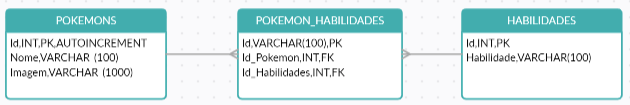
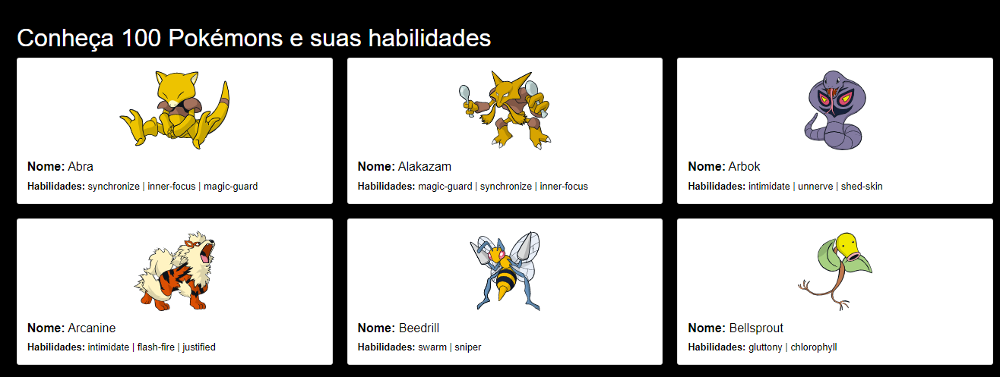

Pokemons
========
O objetivo do projeto é exibir 100 Pokémons e suas habilidades, com base na [PokéAPI](https://pokeapi.co/).
Para isso foi criado o base de dados *pokemons_db* com o [SQlite](https://flows.nodered.org/node/node-red-node-sqlite).
- Executando os nós injects `Create table Pokemons`, `Create table Habilidades` e `Create table Pokemon_Habilidades` criamos suas respetivas tabelas na base na estrutura abaixo:   

- Executando o nó `Inserts` fazemos os gets na PokéAPI e inserimos na base de dados
[GET Habilidades](https://pokeapi.co/api/v2/ability?limit=100000): realizamos a consulta de 10mil habilidades e gravamos o nome da habilidade na base.
[GET Pokemons](https://pokeapi.co/api/v2/pokemon?limit=100): realizamos a consulta de 100 pokemons e gravamos seu nome na base.
[GET Pokemon_Habilidades](https://pokeapi.co/api/v2/ability/7): no GET Pokemons é retornado a URL para buscarmos suas habilidades, com essa URL realizamos o GET das habilidades correspondentes com um delay de 2s para evitar instabilidade na PokéAPI, neste momento gravamos na tabela pokemon_habilidades o ID que é uma junção do *slot* + *nome da habilidade*, o id do Pokémon que é recuperado da tabela Pokemons e o id da habilidade que é recuperado da tabela Habilidades. Além disso fazemos um update na tabela Pokemons para gravar a URL de sua imagem. 

- Abrindo no navegador http://127.0.0.1:1880/pokemons encontraremos a lista de 100 Pokémons e suas habilidades.   

